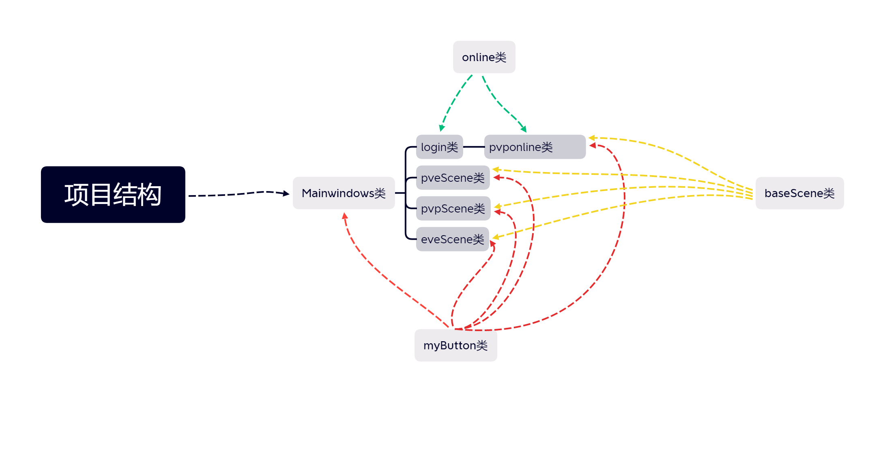
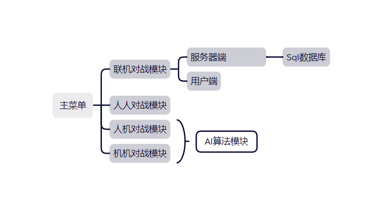
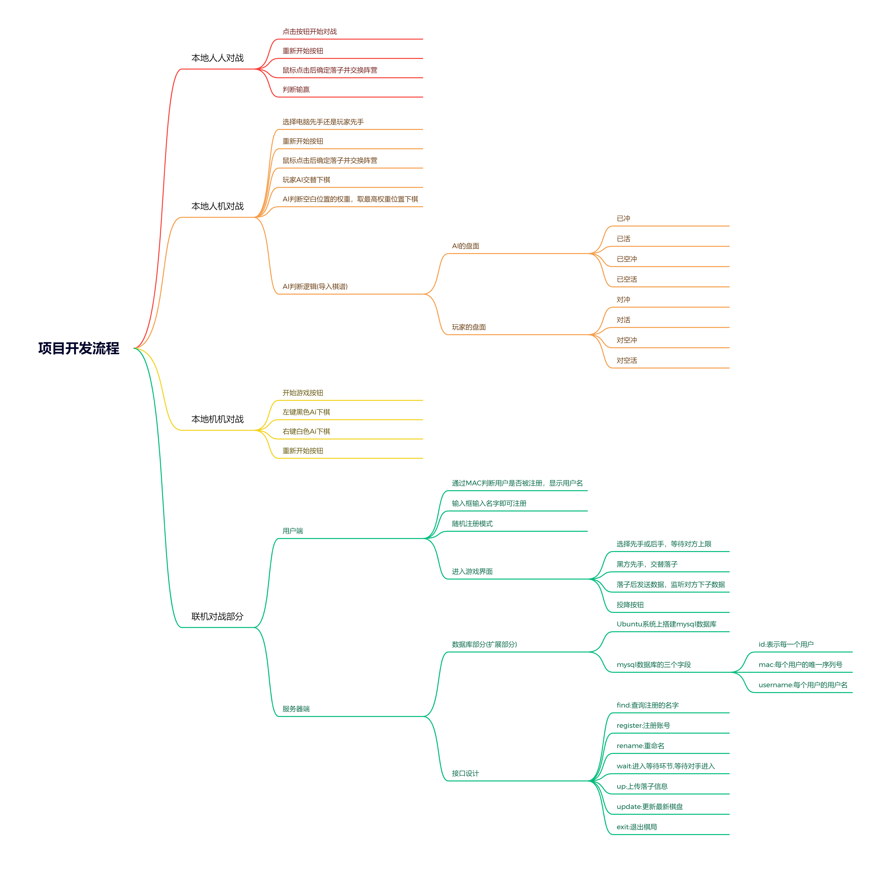

# 五子棋游戏

---

D1anash1ba

2023/6/1

---

## 说明

这个项目是作者大一下的C++大作业，ui设计有点小丑，代码复用率比较高。目前是1.0版本，如果以后有空会进行更新。

总共有本地人人对战，人机对战，机机对战，联机对战四种游戏模式。前端使用C++语言，后端使用了Go + Mysql数据库，实现了用户名注册。

Server文件夹中存放服务器端代码。

Online.cpp实现了联机模块，192.168.230.130:1211 是作者测试使用的Ubuntu虚拟机的IP地址，将这个IP地址更改为公网IP即可实现互联网联机。

## 开发工具

Qt Creator 9.0.2，Vscode, Mingw 11.2.0 64bit，Ubuntu22.04（虚拟机）

## 项目结构

## 模块结构

## 项目开发流程

关注嘉然谢谢喵！

https://space.bilibili.com/672328094